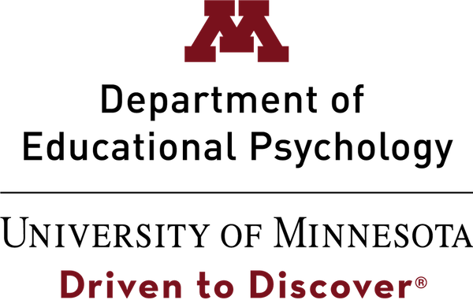
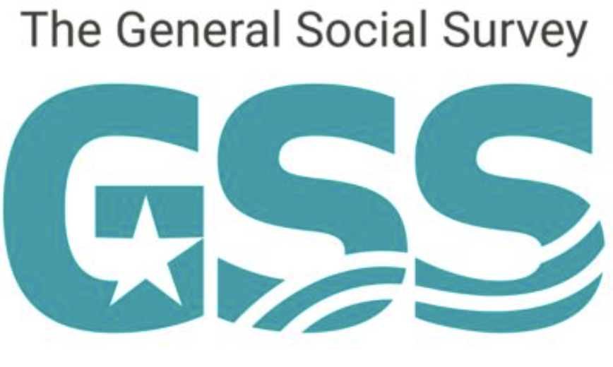

## CourseKata

The After the AP Data Science Capstone uses Jupyter notebooks hosted on CKHub, developed by [CourseKata](https://coursekata.org). If this challenge sparked your interest, contact us [CourseKata.org](https://www.coursekata.org/internal/after-the-ap-challenge) for more classroom-ready resources like these, including materials you can use throughout the year to supplement your regular curriculum.

We’re a nonprofit team of educators and learning scientists who build both full-year and supplementary statistics and data science curricula using the same kinds of Jupyter notebooks, real datasets, and modeling tools used in the challenge.

Our technology and curriculum are designed to bring authentic data science practices into classrooms in ways that are teaching-friendly, meaningful, and equitable. Our research on lowering barriers to participation for students historically marginalized in STEM directly informs how we design our learning materials so more students can engage in mathematics that matters in the modern world.

## University of Minnesota Department of Educational Psychology

{width=300px}

We are working with CourseKata to evaluate the After the AP Data Science Capstone. From providing feedback on materials to surveying participants and instructors, our team will provide insights about this project to help CourseKata improve and refine this for future participants.

Our team consists of professors and graduate students within the Educational Psychology department at the University of Minnesota. Our research focuses on the teaching and learning of statistics and data science. You can find many of our current and former projects at our research lab website: [Lab Advancing Statistics Education Research (LASER)](https://laser-umn.github.io/).

{width=200px}

## The General Social Survey

The After the AP Computer Science Data Science Capstone uses data from the General Social Survey (GSS), conducted by [NORC at the University of Chicago](https://www.norc.org/). The GSS is a nationally representative survey that measures the attitudes and opinions of people in the United States since 1972.

The GSS team at NORC oversees the entire lifecycle of the survey: questionnaire design, data collection, data dissemination, and planning for the next GSS round. GSS data is available to download from the [GSS Data Explorer](https://gssdataexplorer.norc.org/) and from the [GSS website](https://gss.norc.org/).
